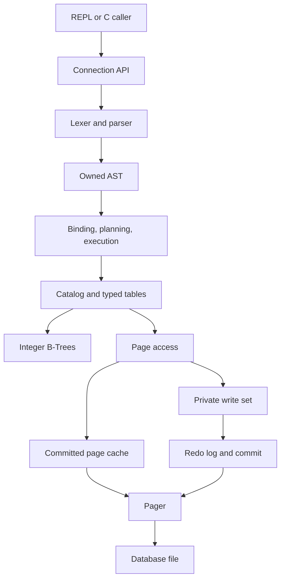

# CDB
### A Database Engine Built From Scratch in C

**CDB — A database engine built from scratch in C to explore how databases work under the hood.**


A **production-quality educational database engine**: explicit ownership, defensive binary codecs, modular interfaces, real B-Tree deletion, transaction-private pages, and a checksummed redo log. This phrase describes the engineering goal and educational scope, not certification for business-critical storage. Read the measured [validation report](docs/validation.md) and [limitations](#limitations) before relying on it.

Prepared for **Shivam Singh · MathTech**.

> “I didn't just learn C syntax. I used C to understand how a database works internally.”

There is no SQLite, other database library, ORM, generated parser, or storage framework inside CDB. The lexer, parser, AST, executor, planner, row codec, slotted pages, cache, B-Tree, catalog, transactions, and WAL are implemented in this repository.

## Start here

1. **Windows beginner:** follow [Windows setup](docs/windows-setup.md), then run the commands below inside Ubuntu/WSL.
2. **Linux:** install a C compiler and Make, extract the ZIP, and open a terminal in `cdb/`.
3. **Learning the design:** start with [Phase 1: architecture](docs/architecture.md) and the [12-phase implementation guide](docs/phases.md).
4. **Checking what actually ran:** read [validation](docs/validation.md). A supplied CI workflow is not a claim that hosted CI has run.

## Quick start

```bash
cd cdb
make
make test
./bin/cdb university.cdb
```

Type SQL (including the semicolon):

```sql
CREATE TABLE students (
    id INTEGER PRIMARY KEY,
    name TEXT,
    age INTEGER
);
INSERT INTO students VALUES (1, 'Shivam', 24);
INSERT INTO students VALUES (2, 'Rahul', 23);
SELECT * FROM students;
SELECT * FROM students WHERE age > 23;
```

Then type `.quit` on its own line. Restart:

```bash
./bin/cdb university.cdb
```

```sql
SELECT * FROM students;
```

The two committed records remain. An uncommitted `BEGIN` transaction is discarded on `.quit`, EOF, or `cdb_close()`.

### Run the included example

Create a new demo file in the current directory:

```bash
./bin/cdb demo.cdb --file examples/university.sql
./bin/cdb demo.cdb
```

Or inspect the already generated sample:

```bash
./bin/cdb examples/university.cdb
```

The sample has `students`, `courses`, and `faculty`. Use the SQL script on a **new** filename: it intentionally reports duplicate tables if run twice. The database creates a sibling `.wal` file; leave it beside the database.

## Why CDB?

CDB connects C fundamentals to a complete persistence path. An insert travels from text to tokens, an owned AST, schema checks, a packed row, a page slot, and a transaction write set. Commit first makes redo durable, then installs the changed pages. A SELECT can decode every heap page or use a B-Tree to fetch only matching record locations.

The repository emphasizes inspectable mechanisms over SQL breadth. You can inspect its pages, explain its plans, print its trees, deliberately terminate a **test build** during commit, and reproduce its benchmarks.

## Features

| Area | Implemented in v0.1.0 |
|---|---|
| SQL | CREATE/DROP TABLE, INSERT, SELECT, UPDATE, DELETE, CREATE INDEX |
| Expressions | Comparisons, AND/OR/NOT, parentheses, IS [NOT] NULL, arithmetic in predicates and UPDATE |
| Values | Signed 64-bit INTEGER, binary64 FLOAT, owned TEXT, BOOLEAN, NULL |
| Constraints | Column/type checks, one INTEGER PRIMARY KEY, NOT NULL, duplicate name/key rejection |
| Storage | 4096-byte slotted pages, stable slots, compaction, checksums, explicit little-endian encoding |
| Cache | 64 committed-page frames, pin/unpin, clock eviction, observable counters |
| Index | Degree-8 B-Tree, insert/search/equality visit/delete, split/borrow/merge, integrity checks |
| Planner | Integer equality index lookup, including an equality inside AND; otherwise scan |
| Transactions | BEGIN/COMMIT/ROLLBACK, autocommit, private dirty pages, transactional DDL |
| Recovery | Full-page redo WAL, transaction checksums/identity, commit marker, startup replay |
| Tools | REPL, scripts, static C library, debug/release builds, sanitizers, stress tests, benchmarks |

**Index definitions persist; B-Tree nodes are rebuilt in RAM at open/rollback.** Heap rows stay on paged storage. This is not an in-memory copy of the entire database. Each indexed entry and each dirty transaction page does consume RAM.

## Architecture



There are no parsing calls in storage code and no query-result printing in table/index/pager code. `cdb_execute()` returns structured results. The REPL owns their presentation. See [architecture](docs/architecture.md), [dependency map](docs/architecture.md#dependencies), and [repository tree](docs/repository-tree.md).

## Database internals

- **Why pages?** They give the pager a fixed I/O unit and isolate record placement from queries.
- **Why a buffer pool?** Repeated reads can avoid disk I/O; pinning prevents eviction while a page is borrowed.
- **Why serialization?** Compiler padding and pointers never become a file format.
- **Why B-Trees/indexes?** Integer equality narrows work to matching `(page, slot)` locations instead of decoding every row.
- **Why a WAL?** A complete, synced redo record can reconstruct a committed transaction after interrupted page writes.
- **Why planning?** The same query can use a scan or an available index without changing SQL semantics.

[Storage engine](docs/storage-engine.md) documents every byte offset. [B-Tree internals](docs/btree.md) explains split, merge, duplicate secondary keys, and deletion. [Transactions](docs/transactions.md) states the crash model precisely.

## Installation and build

The engine requires a C17 compiler, GNU Make, libc, libm, and the POSIX file APIs used on Linux/macOS. **Zero third-party engine dependencies.** Python is not required to build or test it.

Ubuntu/Debian:

```bash
sudo apt update
sudo apt install build-essential
make
```

Optional development tools:

```bash
sudo apt install clang clang-format gdb valgrind
```

macOS: install Apple command line tools with `xcode-select --install`, then use `make CC=clang`. macOS compilation is intended and included in CI configuration but was **NOT VERIFIED IN THIS ENVIRONMENT**. Power-loss persistence behavior on macOS, network filesystems, and removable media is unverified.

Windows is supported through **WSL2 + Ubuntu**, with a [step-by-step guide](docs/windows-setup.md). Native MSVC/MinGW/Win32 builds are **NOT IMPLEMENTED**; POSIX locking, positioned I/O, and sync calls require a platform backend first.

```bash
make                    # debug build -> bin/cdb
make debug              # debug symbols, -O0
make release            # -O2 -> bin/cdb
make clean              # removes only build/ and bin/
make CC=gcc             # choose GCC (clean first when changing compiler)
make CC=clang           # choose Clang
```

All objects are in `build/<mode>/`; all executables are in `bin/`. The reusable archive is `build/<mode>/libcdb.a`. No objects are created at the repository root. `make clean` does not delete your database files.

## CLI and SQL examples

```text
.help
.tables
.schema
.schema students
.stats
.check
.btree students id
.version
.quit
.exit
```

Meta commands start at the beginning of their own line; do not add a SQL semicolon. SQL can span lines; semicolons inside strings/comments do not terminate statements. Batch mode stops with a nonzero exit status on the first error. Results use ASCII table borders; long TEXT cells are abbreviated to approximately 72 bytes for display. The C API returns full text.

```sql
CREATE TABLE users (
    id INTEGER PRIMARY KEY,
    name TEXT NOT NULL,
    age INTEGER,
    score FLOAT,
    active BOOLEAN
);
INSERT INTO users VALUES (1, 'Shivam', 24, 9.5, TRUE), (2, 'Rahul', 23, NULL, FALSE);
INSERT INTO users (id, name) VALUES (3, 'Ada');
SELECT id, name FROM users WHERE age >= 18 AND active = TRUE;
SELECT * FROM users WHERE score IS NULL;
UPDATE users SET age = age + 1 WHERE id = 1;
DELETE FROM users WHERE id = 2;
CREATE INDEX idx_users_age ON users(age);
EXPLAIN SELECT * FROM users WHERE age = 25;
SELECT * FROM users WHERE age = 25;
SELECT * FROM users LIMIT 10;
```

Identifiers are ASCII, case-insensitive, normalized to lowercase, and limited to 31 bytes. Strings use SQL doubled quotes (`'it''s'`); backslash escapes and quoted identifiers are not implemented. TEXT is an opaque non-NUL byte string; no Unicode collation is promised. SELECT column lists contain column names, not computed expressions. See the full [grammar and semantics](docs/query-engine.md).

## Transactions and recovery

```sql
BEGIN;
INSERT INTO users (id, name) VALUES (99, 'Temporary');
ROLLBACK;
SELECT * FROM users WHERE id = 99;
```

Single writes outside BEGIN autocommit. A failed **write execution** aborts the whole explicit transaction. Syntax errors and read errors leave it active; nested BEGIN is rejected. No savepoints, MVCC, concurrent transactions, or statement-level undo inside an explicit transaction are claimed.

The connection holds an exclusive nonblocking file lock for its entire lifetime. A second cooperating connection receives BUSY. One thread must own a connection; no thread-safety guarantee is provided.

Commit: write changed page images and a commit marker to the WAL → `fsync(WAL)` → apply pages → `fsync(database)` → truncate and sync the WAL. Recovery validates the **entire** log before replay. I/O failure during commit makes its outcome uncertain; close and reopen for recovery. Do not manually delete a nonempty WAL. See [guarantees and limits](docs/transactions.md).

## Testing

```bash
make test                         # 11 deterministic groups + subprocess CLI checks
make stress                       # 100,000 rows by default
make stress ROWS=10000
make test-asan                    # address + leak detection by default
make test-ubsan                   # undefined behavior, fail on report
make sanitize                    # sequential ASan and UBSan targets
make valgrind                    # requires installed Valgrind
make lint                        # GCC static analyzer, warnings as errors
make format                      # requires installed clang-format
```

Tests cover row round-trips/truncation, tokens/locations, malformed/random SQL, page compaction, pinned-cache exhaustion, B-Tree insert/delete invariants, constraints, rollback of data/DDL/indexes, secondary index maintenance, restart persistence, growing-row relocation, exclusive locking, five process-termination points, and corrupt database/WAL rejection.

Some sandboxed runtimes prevent LeakSanitizer from enumerating `/proc` threads. For address checking **without claiming leak detection**:

```bash
ASAN_OPTIONS=detect_leaks=0:halt_on_error=1 make test-asan
```

Tests passed here under GCC in debug/release and under ASan (leak checking disabled) and UBSan; see [the exact report](docs/validation.md). Valgrind, Clang, macOS, and WSL execution were **NOT VERIFIED IN THIS ENVIRONMENT**. CI is configured, not reported as remotely passed. No fabricated build/test/stars badges are used.

## Benchmarks

```bash
make MODE=release benchmark ROWS=100000
# or
sh scripts/benchmark.sh 100000
```

The executable measures batch INSERT, full-scan SELECT, CREATE INDEX, indexed SELECT, UPDATE, and DELETE using a monotonic clock. It checks the query plan and row count before accepting a measurement. The scan/index comparison uses identical SQL against the same rows before/after index creation and reports per-query means. It is a microbenchmark, not a concurrency or hardware durability benchmark. A real sample run and its environment are in [benchmark results](docs/benchmark-results.md).

## Debugging and C embedding

```bash
make debug
CDB_LOG_LEVEL=DEBUG ./bin/cdb university.cdb
gdb --args ./bin/cdb-debug university.cdb
```

Levels: ERROR, WARN, INFO, DEBUG, TRACE. `.stats` reports actual page/cache counters; `.btree table column` prints nodes; `.check` validates pages and B-Tree structure. The [debugging guide](docs/debugging.md) includes breakpoints, sanitizers, and performance analysis. [C API tutorial](docs/api.md) includes a compilable embedding example.

## Project structure

| Directory | Responsibility |
|---|---|
| `include/cdb/` | Public and module interfaces; `internal.h` is private |
| `src/core/`, `src/lexer/`, `src/parser/` | Connection, values, errors, SQL frontend |
| `src/execution/` | Binding, planning, structured results, mutation candidate collection |
| `src/storage/`, `src/table/` | Pages, pager, cache, row codec, heap tables, catalog |
| `src/index/`, `src/transaction/` | B-Tree/index maintenance, transactions, WAL/recovery |
| `src/repl/` | Statement splitting and presentation |
| `tests/`, `benchmarks/` | Deterministic checks and actual measurements |
| `docs/`, `examples/`, `scripts/` | Learning resources, data, automation |
| `.github/workflows/ci.yml` | Linux GCC/Clang, debug/release, sanitizer, macOS jobs |

The planner is deliberately a small strategy-selection function in the executor instead of a mostly empty planner subsystem. Dirty pages belong to transactions instead of eviction-capable cache frames, enforcing no-steal ordering. Index metadata persists while nodes are reconstructed. These choices and their costs are documented in [architecture](docs/architecture.md).

## Limitations

- Single connection; no concurrent readers/writers, threads, server, network protocol, users, encryption, or access-control layer.
- INTEGER-only indexes and primary keys; one index per column. No persistent B-Tree nodes or range-index plans. Opening/rollback scans live tables to rebuild indexes.
- At most 32 live tables, 16 columns/table, 31-byte identifiers, 4064-byte encoded rows, 1 MiB SQL input, 4096 VALUES tuples/statement, 256 expression nodes and 64 parser recursion levels.
- SELECT materializes up to 100,000 rows. UPDATE/DELETE collect up to one million candidate RIDs before mutation. LIMIT caps output but does not stop page scanning early.
- No overflow pages. Transactions hold up to 65,536 dirty pages in memory (256 MiB of page payload plus metadata). The format caps the file at 1,048,576 pages (4 GiB); that maximum has not been stress-tested.
- Deletes retain tombstones; inserts reuse slots in the current tail page. DROP leaves orphan pages. There is no global free-page reuse, truncation, VACUUM, backup API, or migration tool.
- No JOIN, ORDER BY, GROUP BY, aggregates, subqueries, ALTER TABLE, DROP INDEX, foreign keys, prepared statements, or parameter binding.
- Checksums detect accidental damage; they are not authentication. No recovery promise for malicious rewrites, lost WALs, broken fsync/locking, filesystem corruption, or failing hardware. Process-crash testing is not physical power-loss testing.
- SELECT row order is unspecified. Updates enforce primary-key uniqueness row by row; swapping keys can fail even if the hypothetical final table would be unique.

## What You Learn From CDB

C programming, pointers, memory ownership, file I/O, binary formats, data structures, trees, B-Trees, parsing, compiler frontends, query processing, storage engines, transactions, caching, testing, performance engineering, and system design.

Follow [the learning tutorial](docs/tutorial.md): trace an insert, inspect its serialized row, observe page growth, compare plans, roll back a change, and study recovery. The [commit roadmap](docs/commit-roadmap.md) presents logically complete milestones for recreating the project. It is a recommendation, not invented Git history.

## Roadmap

Completed and deferred work is tracked in [roadmap](docs/roadmap.md). The next storage milestones are fault-injected I/O failures, page reuse/compaction, persistent B-Tree pages, and recovery fuzzing. Larger SQL and server mode follow stronger storage validation.

## Contributing

Read [CONTRIBUTING.md](CONTRIBUTING.md), [CODE_OF_CONDUCT.md](CODE_OF_CONDUCT.md), and [SECURITY.md](SECURITY.md). Bug reports should include a minimal SQL script, compiler/OS, expected result, actual error, and whether a transaction was open. Do not attach private databases publicly.

## License

MIT; see [LICENSE](LICENSE). Documentation and original source are included. Toolchain/development utilities are installed separately and keep their own licenses.
