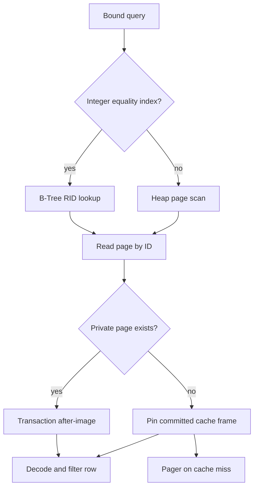
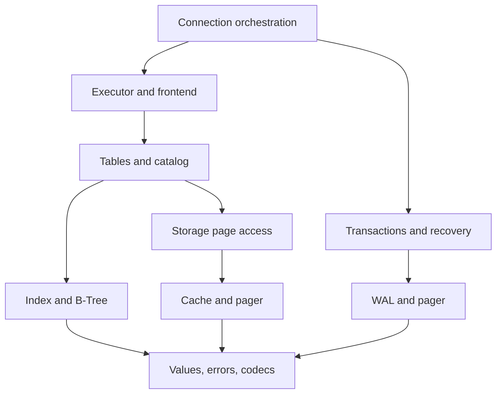

# Phase 1: system architecture and database design

**CDB — A database engine built from scratch in C to explore how databases work under the hood.**

## Scope and invariants

The smallest useful system is a single-connection embedded database with typed heap tables and durable commit. Indexes accelerate access but are not the source of truth. Every state-changing SQL statement executes inside a transaction. Committed pages cannot be evicted with private changes because the cache never owns dirty pages. All disk integers are explicitly encoded little-endian, never written as raw C structs.

The initial architecture separates four kinds of state:

| State | Owner | Lifetime |
|---|---|---|
| SQL tokens | Borrowed slices of caller SQL | During parsing |
| AST and literal strings | `CdbQuery` | One execute call |
| Catalog and B-Tree nodes | `Cdb` connection | Open to close; rebuilt after rollback |
| Page after-images | `CdbTransaction` | BEGIN to COMMIT/ROLLBACK |
| Committed page frames | `CdbBufferPool` | Connection; invalidated after commit |
| Returned rows/text | `CdbResult` | Until caller invokes `cdb_result_free` |

No module exits the process to report an ordinary error. The only deep `_exit` is a compile-time test-only crash injection in WAL tests, absent from the production archive and CLI.

## Modules and APIs

| Module | Files | Principal API / responsibility |
|---|---|---|
| Connection | `src/core/cdb.c` | `cdb_open`, `cdb_execute`, `cdb_close`, transaction wrapper, diagnostics |
| Values | `core/value.c`, `core/types.c` | Owned strings, safe comparisons, encoding primitives |
| Errors | `core/error.c` | Error codes, bounded formatted messages, SQL byte position |
| Frontend | `lexer/lexer.c`, `parser/{parser,ast}.c` | Lexer, precedence parser, AST destructor |
| Execution | `execution/executor.c` | Bind columns/types, choose plan, evaluate, return results |
| Records | `table/row.c` | `cdb_row_size`, serialize/deserialize/deep-copy/free |
| Pages | `storage/page.c` | Slot insert/read/update/delete/compact and structural validation |
| Pager | `storage/pager.c` | Exact positioned I/O, fsync, regular files, exclusive lock |
| Cache | `storage/buffer_pool.c` | Pin/unpin and clock eviction of committed pages |
| Storage bridge | `storage/storage.c` | Read-your-writes, dirty page map, append allocation, superblock |
| Tables/catalog | `table/{table,catalog}.c` | Row validation, page chains, schemas, transactional metadata |
| Index | `index/{btree,index}.c` | Composite integer/RID B-Tree and schema integration |
| Transactions | `transaction/transaction.c` | Begin/commit/rollback and poisoned-connection state |
| WAL | `transaction/wal.c` | Validated redo, commit point, recovery |
| Shell | `repl/repl.c`, `main.c` | CLI options, stream statement boundaries, human output |

Headers under `include/cdb/` expose matching declarations. `cdb.h` is the stable embedding interface. Other headers expose module APIs for learning and unit tests; `internal.h` is private. The implementation does not promise a stable binary ABI before v1.0.

## Read and write data flow

SELECT projects copies of matching values into a result. UPDATE/DELETE first collect matching RIDs so changing a row's index key or relocating it cannot alter the traversal currently finding candidates. UPDATE expressions all see the original row, then schema/constraint checks precede the write. An error aborts the containing write transaction.

INSERT validates the row, checks the primary-key tree, encodes the record, and inserts into the tail page. A full tail links to a newly allocated page. Stable slots make record locations independent of record byte offsets during page compaction.

## Storage model

Page 0 is a versioned superblock. Page 1 begins the catalog chain. Catalog records describe a table's fixed schema, integer index definitions, and first data page. Data pages form forward-only increasing-ID chains; owner IDs prevent cross-table reads. A table ID equals its first data page ID. Last-page pointers are derived during startup/rebuild and are never trusted as separately persisted metadata.

Page IDs are append-only in this version. That makes forward-link validation sufficient to rule out cycles. Dropped pages are retained. A future free list will require new cycle detection, identity/generation handling, and reclamation rules; it cannot simply reuse IDs without changing these invariants.

See [binary format](storage-engine.md) for exact layouts.

## Dependencies

Forward-declared `Cdb` avoids recursive header inclusion. The private connection definition aggregates the modules; the connection layer orchestrates their lifetimes. SQL never reaches the pager, and presentation never reaches the B-Tree.

## Deliberate adaptations to the proposed tree

- Planner logic is a cohesive strategy selector inside `executor.c`; a cost-based planner would justify its own module later.
- Dirty tracking/flushing lives in `transaction.c`/`wal.c`, not in clock-cache eviction. This enforces no-steal.
- Index **definitions** are durable; index **nodes** are an in-memory access structure rebuilt from heap rows. This costs startup time and index RAM, but removes a second recoverable on-disk tree format from v0.1.0.
- Additional tests cover values, recovery, and malformed input. `docs/api.md`, `windows-setup.md`, and `validation.md` make the deliverable easier to use and audit.

## Future server boundary

A future server can keep request parsing, authentication, size limits, and result streaming outside `cdb_execute`. The initial API is already presentation-independent. It is **not** currently safe to call one connection concurrently. A server design must first define scheduling, cancellation, isolation, parameter binding, and backpressure; adding sockets alone would not make it a production multiuser database.
