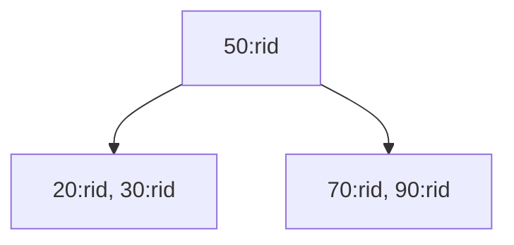

# B-Tree indexing from first principles

## What is stored

CDB implements a B-Tree with minimum degree `t=8`. A nonroot node holds 7..15 entries; an internal node holds one more child pointer than entries. The root is allowed fewer keys. Every leaf has the same depth. Keys exist in internal nodes as well as leaves: this is a B-Tree, not a leaf-only B+Tree.

Each entry is `(signed integer key, RID)`. RID breaks ties, so many rows can share a secondary key without overwriting one another. Exact duplicate pairs are rejected. Primary-key uniqueness is a separate table constraint, checked by integer-key search.

This is a conceptual reduced-degree illustration, not a dump of a valid nonroot degree-8 tree. Run `.btree table column` for actual nodes, including their RIDs.

## Insertion and splitting

Binary search identifies the position inside each node. Before descending into a full child, split it: allocate a sibling, move the upper `t-1` entries, promote the median into the parent, and leave `t-1` entries on the left. Allocate before mutation so allocation failure does not expose half a split. Splitting a full root creates one new root and increases height by one.

A split may change structure even if a later allocation fails, but it preserves existing entries. The SQL layer then rolls back the write and reconstructs trees from the original pages.

## Search and duplicate visitation

`cdb_btree_find` answers whether any entry has a given integer key. `cdb_btree_equal` starts at the composite lower bound `(key, 0)` and visits matching entries/subtrees. It does not scan unrelated keys. Expected structural cost is `O(log_t n + k)` for `k` matches. The executor then reads the associated slotted records and evaluates any remaining conditions.

## Deletion, borrowing, and merging

Before descending during deletion, the algorithm ensures that the child has at least `t` entries. It borrows from a sufficiently populated adjacent sibling through a parent separator, or merges two `t-1` siblings plus that separator into a `2t-1` node.

A key in an internal node is replaced by its predecessor/successor when the corresponding child has spare occupancy. Otherwise the adjacent children merge and deletion continues in the merged node. An empty root shrinks to its only child; deleting the last entry yields a NULL root and zero count.

These operations are implemented, not deferred. The deterministic test inserts 12,000 sequential keys, deletes them in a fixed shuffled order with repeated integrity checks, reinserts a shuffled sequence, and exercises 1,000 duplicate-valued entries. Stress tests exercise maintained trees through real SQL, restart, UPDATE, and DELETE.

## Integrity and storage tradeoff

`cdb_btree_validate` checks occupancy, strict composite ordering, inherited key bounds, equal leaf depth, depth limits, and total entry count. Nodes are allocated/owned by `CdbBtree`; `cdb_btree_free` destroys the entire tree. Index definitions are catalog records; nodes are not persisted. On open/rollback, the engine scans live rows, checks primary keys, and rebuilds all indexes.

Consequences: startup is proportional to live data, index memory grows with row count, and cache-friendly degree 8 is an educational tuning choice. The expected logarithmic tree behavior is not a claim about arbitrary application latency. Persistent index pages, range cursors, text/composite indexes, and a cost-based planner are roadmap items.
