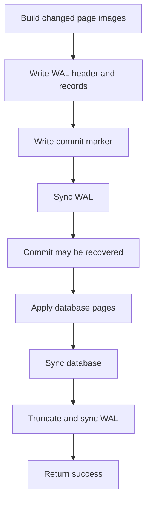

# Transactions, write-ahead logging, and recovery

## Transaction boundaries

Only one connection can hold the file lock. `BEGIN` creates a private write set and remembers the original page count. The first edit of a page copies its committed image; subsequent reads consult the private image first. Newly allocated pages exist only in that write set until commit. Catalog and index structures reflect the connection's own changes.

`ROLLBACK` discards after-images, restores page count, reloads catalog metadata, and rebuilds indexes from the untouched committed pages. This rolls back INSERT, UPDATE, DELETE, CREATE/DROP TABLE, and CREATE INDEX together. Close discards uncommitted memory without performing a disk commit. A failed write execution rolls back the whole transaction, not just its last statement.

## Commit protocol and point of no return

The database superblock is one logged after-image, containing the next generation and page count. Every image is resealed. After WAL sync succeeds, a crash must be treated as possibly committed even if the caller never received success. The log is redone on open. An I/O error while committing poisons the connection; callers must close/reopen rather than issue more queries or pretend a rollback can undo a durable log.

The cache never flushes private changes. This **no-steal** design avoids undo records: without a valid complete redo log, committed pages have not been touched. Dirty pages consume RAM, bounded by 65,536 pages. A transaction with no dirty pages ends without creating a new generation.

## WAL format

The WAL is `<canonical-database-path>.wal`, normally empty after checkpoint. Never separate it from an active database or delete it to “fix” an error.

64-byte header:

| Offset | Bytes | Field |
|---:|---:|---|
| 0 | 4 | `CDBW` |
| 4 | 4 | WAL version = 1 |
| 8 | 4 | Page size = 4096 |
| 12 | 4 | Number of page-image records |
| 16 | 4 | Target database page count |
| 20 | 4 | Reserved |
| 24 | 8 | Transaction generation |
| 32 | 16 | Database identity |
| 48 | 12 | Reserved |
| 60 | 4 | FNV-1a of header bytes 0..59 |

Each record is `u32 page_id` followed by a complete 4096-byte page with its own checksum. The footer is 16 bytes: `CMT1` (4), generation (8), and FNV-1a of the header and all records (4). FNV-1a seed is 2166136261, multiplier 16777619; arithmetic wraps in u32. These checksums detect accidental corruption and are not cryptographic authentication.

## Recovery algorithm

1. Hold the exclusive database lock before examining the WAL.
2. If empty, continue. A short prefix below the header length is discarded.
3. Validate a full header and bounded counts. If its expected complete transaction length exceeds the available bytes, discard the incomplete transaction prefix. Database application cannot have started for this prefix under the protocol.
4. Require an exact complete length and valid footer; reject trailing bytes and malformed complete logs.
5. First pass: validate every record checksum, page structure/ID, uniqueness, superblock inclusion, database identity, generation, and aggregate checksum.
6. If the old superblock remains valid, require the log to match its identity and the same/next generation. If the old superblock was torn, the validated redo superblock can repair it.
7. Only after all validation succeeds, replay every page, sync the database, truncate/sync the WAL, and load the catalog/indexes.

Redo is idempotent. Startup replay can itself be interrupted while the still-complete WAL remains available for another attempt. Bad complete logs fail closed and are preserved. An incomplete prefix can only be distinguished from media damage under the assumption that successful syncs preserve durable bytes; loss/truncation of previously durable data is outside the recovery guarantee.

## Tests and supported failure model

Test-only builds support `CDB_CRASH_POINT` at `wal_header`, `wal_records`, `wal_sync`, `mid_apply`, and `db_sync`. Tests fork a child, terminate with `_exit(86)` at the chosen point, reopen, check row counts, check the WAL clears, and reopen a second time. Before the commit footer, rows remain absent; after a synced complete log, rows are present. Additional tests corrupt WAL bytes and database checksums and require rejection.

Production builds do **not** contain active environment-triggered crash injection. No fault hook is exposed to the normal CLI.

Verified: deterministic process-termination recovery at the listed points on the test Linux filesystem. **NOT VERIFIED:** physical power cuts, disk/controller failure, every possible torn write, interrupted recovery itself, disk-full and arbitrary I/O-error injection, and unusual filesystem semantics. `fsync`, advisory locking, regular files, and durable directory entries must work as expected. No NFS/SMB/FUSE guarantee is made; macOS power-loss behavior is unverified. There is no multi-connection isolation, MVCC, or broad ACID certification.

## Backup and operations

For a simple consistent copy, close CDB cleanly (resolve any uncertain commit by reopening first), then copy the database and its empty companion WAL together. There is no online backup protocol. Keep recovery files intact when reporting corruption. Do not use hard-link aliases or externally edit an open database. Resource/permission errors should be treated as errors, not retried by deleting files.
